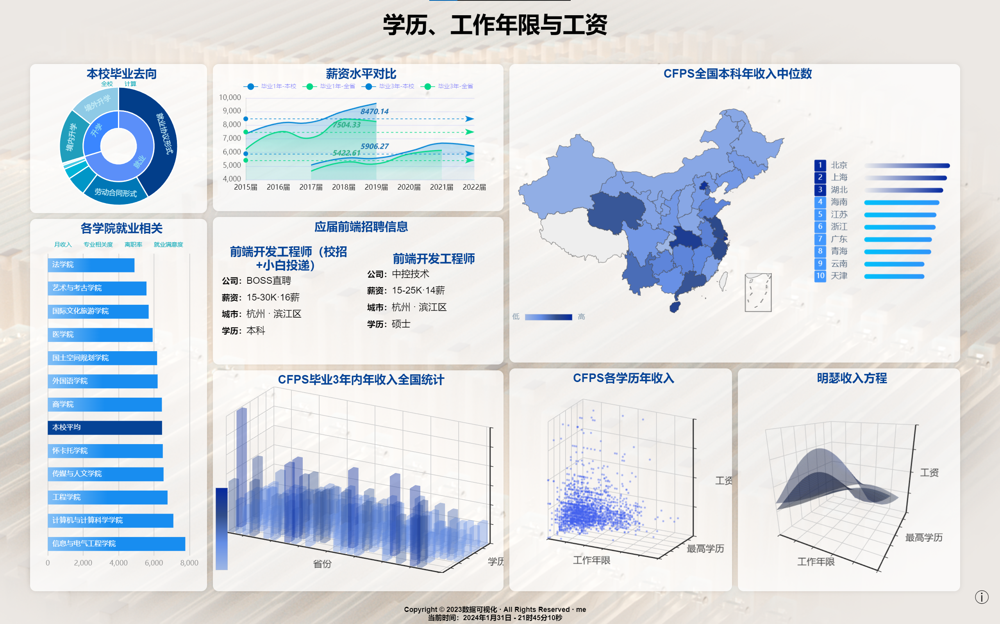

## 1. 数据部分

数据来源：
- 校官网；教学质量报告、就业质量报告
- CFPS 官网，2020 年个人库
- BOSS 直聘招聘信息

### 2. 数据分析

主要通过 stats17 对 cfps 数据进行明瑟回归
数据筛选通过 Python 分拣

### 3. 数据可视化

- echarts 实现：本校毕业去向、各学院就业相关、薪资水平对比、CFPS 全国本科年收入中位数
- echartsGL 动态实现：CFPS 毕业 3 年内年收入全国统计、CFPS 各学历年收入、明瑟收入方程

### 4. 最终效果
lnk封装成bat，实现点击运行

